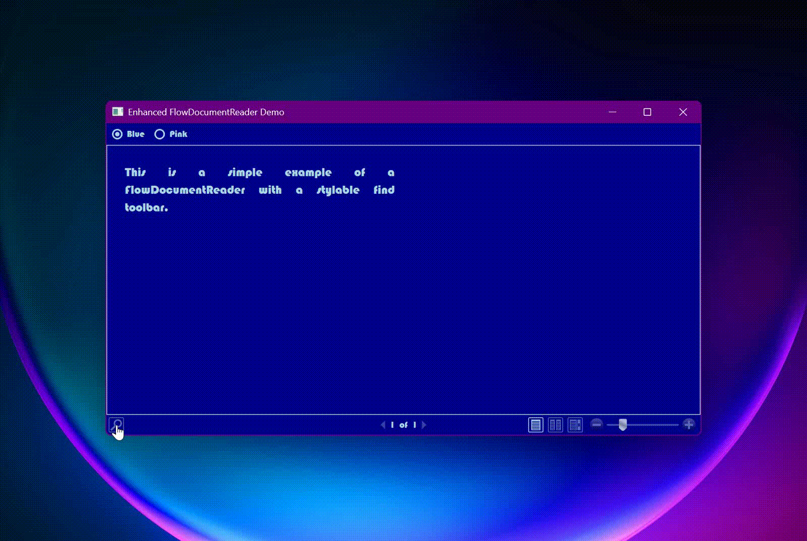
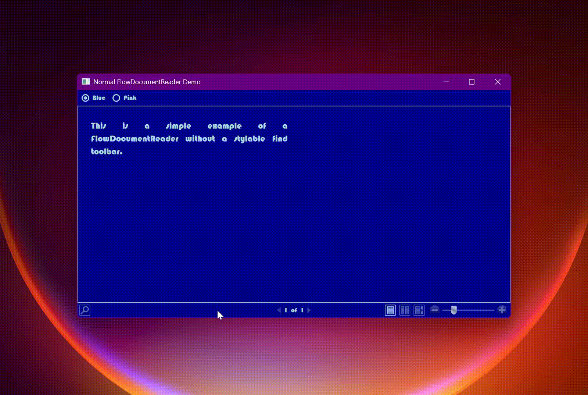

# Enhanced FlowDocument Controls

## Custom find toolbar

The FindToolBar is an internal class and as such its elements can only be accessed in code through the wpf tree.

The EnhancedFlowDocumentReader, EnhancedFlowDocumentPageViewer and EnhancedFlowDocumentScrollViewer controls support supplying your own Find toolbar and has some additional features.

For reference the original FlowDocumentReader xaml, extracted with DotPeek, is available for viewing in the Xaml directory.

The FlowDocumentReader is in generic.xaml obtained from PresentationUI Themes/generic.baml

```xaml
  <Style x:Key="{ComponentResourceKey TypeInTargetAssembly={x:Type MappingPIGen2:PresentationUIStyleResources}, ResourceId=PUIFlowDocumentReader}"
         x:Uid="Style_732" TargetType="{x:Type FlowDocumentReader}">
```

For the find toolbar
generic.xaml

```xaml
  <Style x:Key="{ComponentResourceKey TypeInTargetAssembly={x:Type MappingPIGen2:PresentationUIStyleResources}, ResourceId=PUIFlowViewers_FindToolBar}"
         x:Uid="Style_733" TargetType="{x:Type ToolBar}">
```

FindToolbar.xaml obtained from PresentationUI ms/internal/documents/findtoolbar.baml

# How to use.

For each of the three flow document controls

Set the FindToolbarContent property in xaml and bind to the properties of the FindToolBarViewModel.

The FindToolBarViewModel will be available via either of two methods.

If the root element of the FindToolbarContent implements IFindToolBarViewModelAware it will be available on the FindToolBarViewModel property.

If the root element does not implement IFindToolBarViewModelAware then its DataContext will be set to the FindToolBarViewModel and

the DataContext of the FindRestylingFlowDocumentReader will be available on the OriginalDataContext property of the FindToolBarViewModel.

FindToolBarViewModel IFindToolBarViewModelAware bound controls are provided for the parts of the find toolbar and are pretty much the same as the original.

FindToolbar needs to be the root element as it is IFindToolBarViewModelAware, the other controls RelativeSource bind to it.

FindTextBox is a TextBox and a hint Label, both with Transparent Background.

If you provide your own you need to bind to the FindToolBarViewModel FindText as well as
setting `x:Name="findTextBox"`

Dependency properties.
| Property | Default value |
| --- | --- |
| ShowTooltip | true |
| Tooltip | "Search for a word or phrase in this document." |
| HintText | "Search" |
| HintOpacity | 0.7 |
| HintFontStyle | FontStyles.Italic |
| TextBoxWidth | 183 |
| Foreground | SystemColors.ControlTextBrush|
| Background | null ( for the caret ) |
| SelectionBrush | TextBox.SelectionBrushProperty |
| SelectionOpacity | TextBox.SelectionOpacityProperty |

FindNextPreviousButtons.

If you provide your own you need to bind to the FindToolBarViewModel NextCommand and PreviousCommand.

Dependency properties.
| Property | Default value |
| --- | --- |
| ShowTooltips | true |
| FindNextTooltip | "Find Next" |
| FindPreviousTooltip | "Find Previous" |
| Foreground ( icon colour ) | Default |

The FindToolBarViewModel also has IsSearchUp and IsSearchDown properties if you want to style your own buttons.

FindMenu.

If you provide your own your MenuItem options need to bind to the FindToolBarViewModel properties:

MatchWholeWord
MatchCase
MatchDiacritic
MatchKashida
MatchAlefHamza

Dependency properties.

The "State" properties are fallbacks for the
IsMouseOver
IsKeyboardFocused
triggers and multi trigger
IsPressed trigger.

| Property                            | Default value |
| ----------------------------------- | ------------- |
| MenuBackground                      | null          |
| MenuBorderBrush                     | null          |
| MenuItemBackground                  | null          |
| MenuItemHighlightedBackground       | null          |
| MenuItemForeground                  | null          |
| MenuItemHighlightedForeground       | null          |
| MenuItemBorderBrush                 | null          |
| MenuItemHighlightedBorderBrush      | null          |
| SelectedGlyphBrush                  | null          |
| SelectedGlyphBackground             | null          |
| SelectedGlyphBorderBrush            | null          |
| DropDownGlyphBrush                  | null          |
| DropDownGlyphMouseOverBrush         | null          |
| DropDownGlyphFocusedBrush           | null          |
| DropDownGlyphMouseOverFocusedBrush  | null          |
| DropDownGlyphPressedBrush           | null          |
| DropDownStateGlyphBrush             | null          |
| DropDownGlyphDisabledBrush          | null          |
| DropDownStateBackground             | null          |
| DropDownBackgroundPressed           | null          |
| DropDownBackgroundMouseOver         | null          |
| DropDownBackgroundFocused           | null          |
| DropDownBackgroundMouseOverFocused  | null          |
| DropDownStateBorderBrush            | null          |
| DropDownBorderPressedBrush          | null          |
| DropDownBorderMouseOverBrush        | null          |
| DropDownBorderFocusedBrush          | null          |
| DropDownBorderMouseOverFocusedBrush | null          |
| DropDownTooltip                     | "Find..."     |
| ShowDropDownTooltip                 | true          |

The gifs below demonstrate the EnhancedFlowDocumentReader with the custom FindToolbar compared to the unstyled FlowDocumentReader.

The windows EnhancedFlowDocumentReaderVideoWindow and NormalFlowDocumentReaderVideoWindow from the Demo project were used.

Both windows have a DataContext that is the selected Palette ( as changed by the PaletteSwitcherControl) that provides the required colours
of the provided find toolbar controls used.

EnhancedFlowDocumentReaderVideoWindow.xaml

```xaml
<demoCommon:DemoWindow
  x:Class="Demo.EnhancedFlowDocumentReaderVideoWindow"
  xmlns="http://schemas.microsoft.com/winfx/2006/xaml/presentation"
  xmlns:x="http://schemas.microsoft.com/winfx/2006/xaml"
  xmlns:d="http://schemas.microsoft.com/expression/blend/2008"
  xmlns:mc="http://schemas.openxmlformats.org/markup-compatibility/2006"
  xmlns:demoCommon="clr-namespace:DemoCommon;assembly=DemoCommon"
  xmlns:findControls="clr-namespace:EnhancedFlowDocumentControls.FindToolbarControls;assembly=EnhancedFlowDocumentControls"
  xmlns:flowControls="clr-namespace:EnhancedFlowDocumentControls.FlowDocumentControls;assembly=EnhancedFlowDocumentControls"
  Title="Enhanced FlowDocumentReader Demo"
  mc:Ignorable="d">
  <DockPanel
    LastChildFill="True">
    <demoCommon:PaletteSwitcherControl
      DockPanel.Dock="Top" />
    <flowControls:EnhancedFlowDocumentReader
      BorderBrush="{Binding MainForeground}"
      BorderThickness="1"
      SelectionBrush="{Binding MainForeground}"
        >
      <flowControls:EnhancedFlowDocumentReader.Document>
        <FlowDocument
          FontFamily="{StaticResource fontFamily}">
          <Paragraph>
            <Run
              Text="This is a simple example of a FlowDocumentReader with a stylable find toolbar." />
          </Paragraph>
        </FlowDocument>
      </flowControls:EnhancedFlowDocumentReader.Document>
      <flowControls:EnhancedFlowDocumentReader.FindToolbarContent>
        <findControls:FindToolBar>
          <Border
            Margin="5,1,0,1"
            Padding="0"
            Background="{Binding Background}"
            BorderBrush="{Binding Border}"
            BorderThickness="1"
            SnapsToDevicePixels="true">
            <StackPanel
              Orientation="Horizontal">
              <findControls:FindTextBox
                Background="{Binding Background}"
                Foreground="{Binding Text}"
                HintText="Do it"
                SelectionBrush="{Binding MainBackground}" />
              <findControls:FindNextPreviousButtons
                Foreground="{Binding PrevNext}" />
              <findControls:FindMenu
                DropDownGlyphBrush="{Binding DropDownGlyphBrush}"
                DropDownStateBackground="{Binding DropDownStateBackground}"
                DropDownStateBorderBrush="{Binding DropDownStateBorderBrush}"
                DropDownStateGlyphBrush="{Binding DropDownStateGlyphBrush}"
                MenuBackground="{Binding MenuBackground}"
                MenuBorderBrush="{Binding MenuBorderBrush}"
                MenuItemBackground="{Binding MenuItemBackground}"
                MenuItemBorderBrush="{Binding MenuItemBorderBrush}"
                MenuItemForeground="{Binding MenuItemForeground}"
                MenuItemHighlightedBackground="{Binding MenuItemHighlightedBackground}"
                MenuItemHighlightedBorderBrush="{Binding MenuItemHighlightedBorderBrush}"
                MenuItemHighlightedForeground="{Binding MenuItemHighlightedForeground}"
                SelectedGlyphBackground="{Binding SelectedGlyphBackground}"
                SelectedGlyphBorderBrush="{Binding SelectedGlyphBorderBrush}"
                SelectedGlyphBrush="{Binding SelectedGlyphBrush}" />
            </StackPanel>
          </Border>
        </findControls:FindToolBar>
      </flowControls:EnhancedFlowDocumentReader.FindToolbarContent>
    </flowControls:EnhancedFlowDocumentReader>
  </DockPanel>
</demoCommon:DemoWindow>


```




## EnhancedFlowDocumentReader additional

### Key bindings

Note that there are some keys that are processed by the FlowDocumentReader

Ctrl~M for cycling between the modes.

Ctrl~ + and - for zooming in and out.

F3 for showing the find toolbar. Once shown will search. Shift key to search backwards.

Enter key when text box has focus will search with current search direction.

This fills the gap - specify a KeyBinding in the XAML - e.g

```xaml
<EnhancedFlowDocumentReader.InputBindings>
    <KeyBinding Command="ApplicationCommands.Find" Modifiers="Ctrl" Key="F" />
    <KeyBinding Command="NavigationCommands.NextPage" Modifiers="Ctrl" Key="N" />
    <KeyBinding Command="NavigationCommands.PreviousPage" Modifiers="Ctrl" Key="P" />
</EnhancedFlowDocumentReader.InputBindings>
```

Also supports `NavigationCommands.LastPage` and `NavigationCommands.FirstPage`.

## VerticalScrollbarVisibility

Ronseal.
