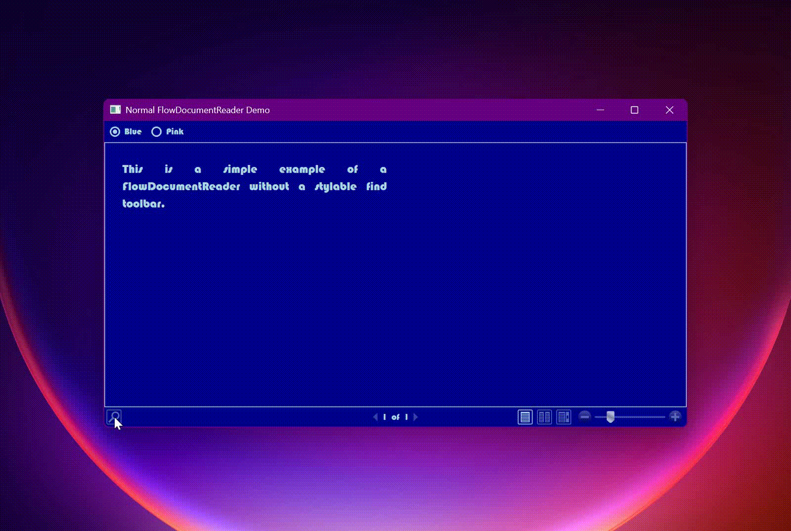

# Enhanced FlowDocument Controls

## Custom find toolbar

The FindToolBar is an internal class and as such its elements can only be accessed in code through the wpf tree.

The EnhancedFlowDocumentReader, EnhancedFlowDocumentPageViewer and EnhancedFlowDocumentScrollViewer controls support supplying your own Find toolbar and has some additional features.

For reference the original FlowDocumentReader xaml, extracted with DotPeek, is available for viewing in the Xaml directory.

The FlowDocumentReader is in generic.xaml obtained from PresentationUI Themes/generic.baml

```xaml
  <Style x:Key="{ComponentResourceKey TypeInTargetAssembly={x:Type MappingPIGen2:PresentationUIStyleResources}, ResourceId=PUIFlowDocumentReader}"
         x:Uid="Style_732" TargetType="{x:Type FlowDocumentReader}">
```

For the find toolbar
generic.xaml

```xaml
  <Style x:Key="{ComponentResourceKey TypeInTargetAssembly={x:Type MappingPIGen2:PresentationUIStyleResources}, ResourceId=PUIFlowViewers_FindToolBar}"
         x:Uid="Style_733" TargetType="{x:Type ToolBar}">
```

FindToolbar.xaml obtained from PresentationUI ms/internal/documents/findtoolbar.baml

# How to use.

For each of the three flow document controls

Set the FindToolbar property in xaml and bind to the properties of the IFindToolBarViewModel.

```cs

    public interface IFindToolBarViewModel
    {
        bool AllowSearchingWhenEmptyText { get; set; }

        string FindText { get; set; }

        bool IsSearchDown { get; }

        bool IsSearchUp { get; }

        bool MatchAlefHamza { get; set; }

        bool MatchCase { get; set; }

        bool MatchDiacritic { get; set; }

        bool MatchKashida { get; set; }

        bool MatchWholeWord { get; set; }

        ICommand NextCommand { get; }

        object OriginalDataContext { get; }

        ICommand PreviousCommand { get; }

```

Set AllowSearchingWhenEmptyText to true to enable Next and Previous buttons when the FindText is empty.

The IFindToolBarViewModel will be available via either of two methods.

If the root element of the FindToolbar implements IFindToolBarViewModelAware it will be available on the FindToolBarViewModel property.

If the root element does not implement IFindToolBarViewModelAware then its DataContext will be set to the FindToolBarViewModel and

the DataContext of the FindRestylingFlowDocumentReader will be available on the OriginalDataContext property of the FindToolBarViewModel.

FindToolBarViewModel IFindToolBarViewModelAware bound controls are provided for the parts of the find toolbar and are pretty much the same as the original.

These controls, FindTextBox, FindNextPreviousButtons and FindMenu, RelativeSource bind to it.

The FindToolbar control is IFindToolBarViewModelAware and can be used as the FindToolBar property of the EnhancedFlowDocumentReader, EnhancedFlowDocumentPageViewer and EnhancedFlowDocumentScrollViewer.

FindTextBox is a TextBox and a hint Label, both with Transparent Background.

If you provide your own you need to bind to the FindToolBarViewModel FindText as well as
setting `x:Name="findTextBox"`

Dependency properties.
| Property          | Default value                                   |
| ---               | ---                                             |
| ShowTooltip       | true                                            |
| Tooltip           | "Search for a word or phrase in this document." |
| HintText          | "Search"                                        |
| HintOpacity       | 0.7                                             |
| HintFontStyle     | FontStyles.Italic                               |
| TextBoxWidth      | 183                                             |
| Foreground        | SystemColors.ControlTextBrush                   |
| Background        | null                                            |
| CaretBrush        | null                                            |
| SelectionBrush    | TextBox.SelectionBrushProperty                  |
| SelectionOpacity  | TextBox.SelectionOpacityProperty                |

Note that a TextBox caret brush can come from the CaretBrush or be an inversion ( `new SolidColorBrush(Color.FromRgb(~color.R, ~color.G, ~color.B));`) of either the Background or SystemColors.WindowColor.


FindNextPreviousButtons.

If you provide your own you need to bind to the FindToolBarViewModel NextCommand and PreviousCommand.

Dependency properties.

The "State" properties are fallbacks for the
IsMouseOver
IsKeyboardFocused
triggers and multi trigger
IsPressed trigger.

If you are not changing background or border due to triggers then GlyphBrush is all that is required.

| Property                          | Default value    |
| ---                               | ---              |
| ShowTooltips                      | true             |
| FindNextTooltip                   | "Find Next"      |
| FindPreviousTooltip               | "Find Previous"  |
| GlyphBrush                        | null             |
| StateGlyphBrush                   | GlyphBrush       |
| GlyphMouseOverBrush               | StateGlyphBrush  |
| GlyphFocusedBrush                 | StateGlyphBrush  |
| GlyphMouseOverFocusedBrush        | StateGlyphBrush  |
| GlyphPressedBrush                 | StateGlyphBrush  |
| StateBackground                   | null             |
| StateBorderBrush                  | null             |
| BackgroundMouseOver               | StateBackground  |
| BorderMouseOverBrush              | StateBorderBrush |
| BackgroundFocusedBrush            | StateBackground  |
| BorderFocusedBrush                | StateBorderBrush |
| BackgroundMouseOverFocused        | StateBackground  |
| BorderMouseOverFocusedBrush       | StateBorderBrush |
| BackgroundPressed                 | StateBackground  |
| BorderPressedBrush                | StateBorderBrush |
| FocusVisualStyle ( button focus ) | Button Default   |

The FindToolBarViewModel also has IsSearchUp and IsSearchDown properties if you want to style your own buttons.

FindMenu.

If you provide your own your MenuItem options need to bind to the FindToolBarViewModel properties:

MatchWholeWord
MatchCase
MatchDiacritic
MatchKashida
MatchAlefHamza

Dependency properties.

The "State" properties are fallbacks for the
IsMouseOver
IsKeyboardFocused
triggers and multi trigger
IsPressed trigger.

If you are not changing backgroundor or border due to triggers then DropDownGlyphBrush is all that is required for the drop down.

Menu, MenuItem and SelectedGlyph properties should be provided.

| Property                            | Default value            |
| ----------------------------------- | -------------            |
| MenuBackground                      | null                     |
| MenuBorderBrush                     | null                     |
| MenuItemBackground                  | null                     |
| MenuItemHighlightedBackground       | null                     |
| MenuItemForeground                  | null                     |
| MenuItemHighlightedForeground       | null                     |
| MenuItemBorderBrush                 | null                     |
| MenuItemHighlightedBorderBrush      | null                     |
| SelectedGlyphBrush                  | null                     |
| SelectedGlyphBackground             | null                     |
| SelectedGlyphBorderBrush            | null                     |
| DropDownGlyphBrush                  | null                     |
| DropDownStateGlyphBrush             | DropDownGlypBrush        |
| DropDownGlyphMouseOverBrush         | DropDownStateGlyphBrush  |
| DropDownGlyphFocusedBrush           | DropDownStateGlyphBrush  |
| DropDownGlyphMouseOverFocusedBrush  | DropDownStateGlyphBrush  |
| DropDownGlyphPressedBrush           | DropDownStateGlyphBrush  |
| DropDownGlyphDisabledBrush          | null                     |
| DropDownStateBackground             | null                     |
| DropDownBackgroundPressed           | DropDownStateBackground  |
| DropDownBackgroundMouseOver         | DropDownStateBackground  |
| DropDownBackgroundFocused           | DropDownStateBackground  |
| DropDownBackgroundMouseOverFocused  | DropDownStateBackground  |
| DropDownStateBorderBrush            | null                     |
| DropDownBorderPressedBrush          | DropDownStateBorderBrush |
| DropDownBorderMouseOverBrush        | DropDownStateBorderBrush |
| DropDownBorderFocusedBrush          | DropDownStateBorderBrush |
| DropDownBorderMouseOverFocusedBrush | DropDownStateBorderBrush |
| DropDownTooltip                     | "Find..."                |
| ShowDropDownTooltip                 | true                     |
| DropDownFocusVisualStyle            | null ( none )            |

The gifs below demonstrate the EnhancedFlowDocumentReader with the custom FindToolbar compared to the unstyled FlowDocumentReader.

The windows EnhancedFlowDocumentReaderVideoWindow and NormalFlowDocumentReaderVideoWindow from the Demo project were used.

Both windows have a DataContext that is the selected Palette ( as changed by the PaletteSwitcherControl) that provides the required colours
of the provided find toolbar controls used.

EnhancedFlowDocumentReaderVideoWindow.xaml

```xaml
<demoCommon:DemoWindow
  x:Class="Demo.EnhancedFlowDocumentReaderVideoWindow"
  x:ClassModifier="internal"
  xmlns="http://schemas.microsoft.com/winfx/2006/xaml/presentation"
  xmlns:x="http://schemas.microsoft.com/winfx/2006/xaml"
  xmlns:d="http://schemas.microsoft.com/expression/blend/2008"
  xmlns:mc="http://schemas.openxmlformats.org/markup-compatibility/2006"
  xmlns:demoCommon="clr-namespace:Demo.Common"
  xmlns:findControls="clr-namespace:EnhancedFlowDocumentControls.FindToolBarControls;assembly=EnhancedFlowDocumentControls"
  xmlns:flowControls="clr-namespace:EnhancedFlowDocumentControls.FlowDocumentControls;assembly=EnhancedFlowDocumentControls"
  Title="Enhanced FlowDocumentReader Demo"
  mc:Ignorable="d">
  <DockPanel
    LastChildFill="True">
    <demoCommon:PaletteSwitcherControl
      DockPanel.Dock="Top" />
    <flowControls:EnhancedFlowDocumentReader
      BorderBrush="{Binding MainForeground}"
      BorderThickness="1"
      SelectionBrush="{Binding MainForeground}">
      <flowControls:EnhancedFlowDocumentReader.Document>
        <FlowDocument
          FontFamily="{StaticResource fontFamily}">
          <Paragraph>
            <Run
              Text="This is a simple example of a FlowDocumentReader with a stylable find toolbar." />
          </Paragraph>
        </FlowDocument>
      </flowControls:EnhancedFlowDocumentReader.Document>
      <flowControls:EnhancedFlowDocumentReader.FindToolBar>
        <findControls:FindToolBar
          Margin="4,0,0,0"
          Padding="4,1,4,1"
          Background="{Binding Background}">
          <StackPanel
            Orientation="Horizontal">
            <StackPanel.Resources>
              <Style
                x:Key="CommonFocusVisualStyle">
                <Setter Property="Control.Template">
                  <Setter.Value>
                    <ControlTemplate>
                      <Rectangle
                        Margin="0"
                        SnapsToDevicePixels="true"
                        Stroke="{Binding Text}"
                        StrokeDashArray="1 2"
                        StrokeThickness="1" />
                    </ControlTemplate>
                  </Setter.Value>
                </Setter>
              </Style>
            </StackPanel.Resources>
            <findControls:FindTextBox
              Background="{Binding Background}"
              Foreground="{Binding Text}"
              HintText="Do it"
              SelectionBrush="{Binding MainBackground}" />
            <findControls:FindNextPreviousButtons
              FocusVisualStyle="{StaticResource ResourceKey=CommonFocusVisualStyle}"
              GlyphBrush="{Binding GlyphBrush}"
              StateBackground="{Binding StateBackground}"
              StateBorderBrush="{Binding StateBorderBrush}"
              StateGlyphBrush="{Binding StateGlyphBrush}" />
            <findControls:FindMenu
              DropDownFocusVisualStyle="{StaticResource ResourceKey=CommonFocusVisualStyle}"
              DropDownGlyphBrush="{Binding GlyphBrush}"
              DropDownStateBackground="{Binding StateBackground}"
              DropDownStateBorderBrush="{Binding StateBorderBrush}"
              DropDownStateGlyphBrush="{Binding StateGlyphBrush}"
              MenuBackground="{Binding MenuBackground}"
              MenuBorderBrush="{Binding MenuBorderBrush}"
              MenuItemBackground="{Binding MenuItemBackground}"
              MenuItemBorderBrush="{Binding MenuItemBorderBrush}"
              MenuItemForeground="{Binding MenuItemForeground}"
              MenuItemHighlightedBackground="{Binding MenuItemHighlightedBackground}"
              MenuItemHighlightedBorderBrush="{Binding MenuItemHighlightedBorderBrush}"
              MenuItemHighlightedForeground="{Binding MenuItemHighlightedForeground}"
              SelectedGlyphBackground="{Binding SelectedGlyphBackground}"
              SelectedGlyphBorderBrush="{Binding SelectedGlyphBorderBrush}"
              SelectedGlyphBrush="{Binding SelectedGlyphBrush}" />
          </StackPanel>
        </findControls:FindToolBar>
      </flowControls:EnhancedFlowDocumentReader.FindToolBar>
    </flowControls:EnhancedFlowDocumentReader>
  </DockPanel>
</demoCommon:DemoWindow>

```




By supplying your own FindToolBar you can also avoid the overhang and clipped drop down issue.


## RetainFindToolBarSettings dependency property

The behaviour of the internal find tool bar is to reset the search options when the FindToolBar is closed and reopened.
Setting the RetainFindToolBarSettings property to true will retain the settings in the IFindToolBarViewModel.

## EnhancedFlowDocumentReader additional

## VerticalScrollbarVisibility

When the `ViewingMode` is `FlowDocumentReaderViewingMode.Scroll` a FlowDocumentScrollViewer derivation is used but its Style property is explicitly set.
and there is no means of setting its VerticalScrollBarVisibility.
The `VerticalScrollBarVisibility` dependency property serves this purpose.

## Notes on key behaviour

F3 for showing the find toolbar. Once shown will search. Shift key to search backwards.

Enter key when text box has focus will search with current search direction.

Key bindings
|Command |FlowDocumentReader|FlowDocumentScrollViewer |FlowDocumentPageViewer|
| -----------------------------|------------------|---------------------------|----------------------|
|Switch viewing modes |Ctrl+M | |No |
| Print / Cancel print |Ctrl+P |Ctrl+P |Ctrl+P |
|Previous/Next/First/Last Page |No key |Key.Prior, Next, Home, End |Left, Up, Prior \| Right, Down, Next \| Home, Ctrl+Home \| Ctrl+End, End|
|Zoom In/Out |Ctrl +, Ctrl - |Ctrl +, Ctrl - |Ctrl +, Ctrl - |
| Line Down/Up/Left/Right | | Down, Up, Left, Right | |

Important to note that if the FlowDocumentReader has focus the page keys will not work !.
If desired you can add them to the FlowDocumentReader InputBindings.
